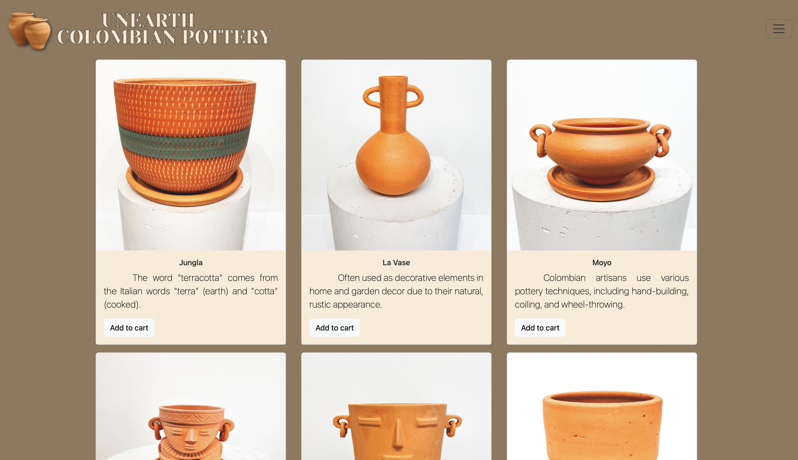

# Capstone1
YearUp - Capstone1 Project 

## Description

E-Commerce Capstone project. Created a user-friendly and visually appealing e-commerce website using HTML and CSS. Selling pottery from a small start up business. It includes five responsive pages such as Home page, User Login page, User Registration page, Products Page and Checkout page. All products 

## Table of Contents

- [Features](#features)
- [Demo](#demo)
- [Insatallation] (#installation)

## Features

- **Responsive Design**: This website is designed to work seamlessly across various devices and screen sizes, ensuring a great user experience on both desktop and mobile.
- **Product Catalog**: I've created a catalog of products with clear descriptions and images. Users can browse and explore various products effortlessly.
- **Checkout Process**: A straightforward and secure checkout process is implemented, allowing users to complete their purchases efficiently.

## Demo

## Installation
Visual Studio Code
Terminal 
Github 

npm install

